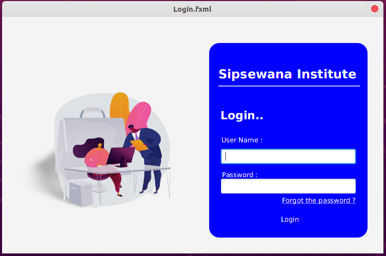

##Personal Profile
##This is the project of the personal website  

--- This is the project that I created to a institute to manage students details;

##Home page

More Details of the project. 
functions of the project :-
 <li> Can Add Students  
 <li> Can Update Students 
 <li> Can Search Students Using Their Id Numbers  
 <li> Can Delete Students   
 <li> Can Add Course  
 <li> Can Update Course Details 
 <li> Can Search Course using it id   
 <li> Can delete Course 
 <li> Can Search Students In Course wise  
    
  
Used Technologies are :-
 
<li> Language : Java
<li> UI Design : JavaFX
<li> Data Base : MySql
<li> Technology : Hibernate
<li> Architecture : Layered
<li> Styles : CSS3
   
 